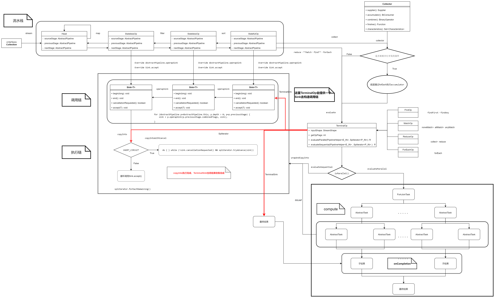

# Java Stream

## 新特性

​	Java 8（又称为jdk1.8）是Java语言开发的一个主要版本。Oracle公司于2014年3月18日发布的Java 8，它支持函数式编程，新的JavaScript引擎，新的日期API，新的Stream API等。

### lambda表达式

​	lambda的表达式的语法格式如下：

``` java
(parameters) -> expression
    或
(parameters) -> { expression; }
```

​	以下是lambda表达式的重要特征：

* **可选类型声明：** 不需要声明参数类型，编译器可以统一识别参数值。

* **可选的参数圆括号：** 一个参数无需定义圆括号，但多个参数需要定义圆括号。

* **可选大括号：** 如果主体包含了一个语句，就不需要使用大括号。

* **可选的返回关键字：**如果主体只有一个表达式返回值则编译器会自动返回值，大括号需要指定明表达式返回了一个数值。

``` java
// 不需要参数
() -> 5
// 接受一个参数
(x) -> 2 * x
// 接受两个参数
(x, y) -> x + y
// 带指定类型参数
(int x, int y) -> x + y
// 接受一个值，打印该值且无返回值
(String s) -> System.out.print(s)
```

### 方法引用

​	方法引用通过方法的名字来指向一个方法。方法引用使用一对冒号`::`

* **构造器引用：**他的语法是`Class::new`，或者更一般的`Class<T>::new`
* **静态方法引用：**它的语法是`Class::static_method`
* **特定类的任意对象的方法引用：**他的语法是`Class::method`
* **特定对象的方法引用：**它的语法是`instance::method`

### 默认方法

​	Java 8新增了接口的默认的方法，我们只需要通过在方法名前面加个`default`关键字即可实现默认方法。

``` java
public interface Closeable {
    default void close() {
        System.out.println("begining close");
    }
}
```

### 函数式接口

​	初识lambda呢，函数式接口肯定是绕不过去的，函数式接口就是一个有且仅有一个抽象方法，但是可以有多个非抽象方法的接口。函数式接口可以被隐式转换为`lambda`表达式。

``` java
@FunctionalInterface
public interface Closeable {
    
    void close();
}
```

​	在`java.util.function`它包含了很多类，用来支持`Java`的函数式编程，该包中的函数式接口有：

| 函数式接口        |    函数描述符     | 原始类型特化                                                 |
| ----------------- | :---------------: | ------------------------------------------------------------ |
| Predicate<T>      |   T -> boolean    | IntPredicate,LongPredicate,DoublePredicate                   |
| Consumer<T>       |     T -> void     | IntConsumer,LongConsumer,DoubleConsumer                      |
| Function<T,R>     |      T -> R       | IntFunction<R>, IntToDoubleFunction,IntToLongFunction，LongFunction<R>, <br />LongToIntFunction,LongToDouble，FunctionDoubleFunction<R>,DoubleToIntFunction,DoubleToLongFunctionToIntFunction<T>,<br />ToLongFunction<T>,ToDoubleFunction<T> |
| Supplier<T>       |      () -> T      | BooleanSupplier,IntSupplier,LongSupplier,DoubleSupplier      |
| UnaryOperator<T>  |      T -> T       | IntUnaryOperator，LongUnaryOperator，DoubleUnaryOperator     |
| BinaryOperator<T> |    (T,T) -> T     | IntBinaryOperator，DoubleBinaryOperator，LongBinaryOperator  |
| BiPredicate<L,R>  | (L,R) ->  boolean |                                                              |
| BiConsumer<T,U>   |   (T,U) -> void   | ObjIntConsumer<T>，ObjDoubleConsumer<T>，ObjLongConsumer<T>  |
| BiFunction<T,U,R> |    (T,U) -> R     | ToIntBiFunction<T,U>，ToLongBiFunction<T,U>，ToDoubleBiFunction<T,U> |

## 操作

|                                   |       Stream操作分类       |                                                              |
| :-------------------------------: | :------------------------: | :----------------------------------------------------------- |
| 中间操作(Intermediate operations) |     无状态(Stateless)      | unordered() filter() map() mapToInt() mapToLong() mapToDouble() flatMap() flatMapToInt() flatMapToLong() flatMapToDouble() peek() |
|                                   |      有状态(Stateful)      | distinct() sorted() limit() skip()                           |
|   结束操作(Terminal operations)   |         非短路操作         | forEach() forEachOrdered() toArray() reduce() collect() max() min() count() |
|                                   | 短路操作(short-circuiting) | anyMatch() allMatch() noneMatch() findFirst() findAny()      |

## 流程

`Stream`相关接口继承图：


`Stream`流水线组织结构示意图：


## Collection

​	类路径`java.util.colltction`

``` java
@Override
default Spliterator<E> spliterator() {
    return Spliterators.spliterator(this, 0);
}
// 常用Stream流转换
default Stream<E> stream() {
    return StreamSupport.stream(spliterator(), false);
}
// 并行流
default Stream<E> parallelStream() {
    return StreamSupport.stream(spliterator(), true);
}

// java.util.stream.StreamSupport#stream(java.util.Spliterator<T>, boolean)
public static <T> Stream<T> stream(Spliterator<T> spliterator, boolean parallel) {
    Objects.requireNonNull(spliterator);
    return new ReferencePipeline.Head<>(spliterator, StreamOpFlag.fromCharacteristics(spliterator), parallel);
}
```

##  AbstractPipeline

​	类路径`java.util.stream.AbstractPipeline`

``` java
// 反向链接到管道链的头部（如果是源阶段，则为自身）。
private final AbstractPipeline sourceStage;

// “上游”管道，如果这是源阶段，则为null。
private final AbstractPipeline previousStage;

// 此管道对象表示的中间操作的操作标志。
protected final int sourceOrOpFlags;

// 管道中的下一个阶段；如果这是最后一个阶段，则为null。 在链接到下一个管道时有效地结束。
private AbstractPipeline nextStage;

// 如果是顺序的，则此管道对象与流源之间的中间操作数；如果是并行的，则为先前有状态的中间操作数。 在管道准备进行评估时有效。
private int depth;

// 源和所有操作的组合源标志和操作标志，直到此流水线对象表示的操作为止（包括该流水线对象所代表的操作）。 在管道准备进行评估时有效。
private int combinedFlags;

// 源拆分器。 仅对头管道有效。 如果管道使用非null值，那么在使用管道之前， sourceSupplier必须为null。 在使用管道之后，如果非null，则将其设置为null。
private Spliterator<?> sourceSpliterator;

// 来源供应商。 仅对头管道有效。 如果非null，则在使用管道之前， sourceSpliterator必须为null。 在使用管道之后，如果非null，则将其设置为null。
private Supplier<? extends Spliterator<?>> sourceSupplier;

// 如果已链接或使用此管道，则为True
private boolean linkedOrConsumed;

// 如果正在执行任何有状态操作，则为true；否则为true。 仅对源阶段有效。
private boolean sourceAnyStateful;

private Runnable sourceCloseAction;

// 如果管道是并行的，则为true；否则，管道为顺序的；否则为true。 仅对源阶段有效。
private boolean parallel;
```

## ReferencePipeline

​	类路径：`java.util.stream.ReferencePipeline`

### filter

``` java
// java.util.stream.ReferencePipeline#filter
@Override
public final Stream<P_OUT> filter(Predicate<? super P_OUT> predicate) {
    Objects.requireNonNull(predicate);
    // 返回一个匿名无状态的管道
    return new StatelessOp<P_OUT, P_OUT>(this, StreamShape.REFERENCE, StreamOpFlag.NOT_SIZED) {
        // 下游生产线所需要的回调接口
        @Override
        Sink<P_OUT> opWrapSink(int flags, Sink<P_OUT> sink) {
            return new Sink.ChainedReference<P_OUT, P_OUT>(sink) {
                @Override
                public void begin(long size) {
                    downstream.begin(-1);
                }
			   // 真正执行操作的方法，依靠ChainedReference内置ReferencePipeline引用下游的回调
                @Override
                public void accept(P_OUT u) {
                    // 只有满足条件的元素才能被下游执行
                    if (predicate.test(u))
                        downstream.accept(u);
                }
            };
        }
    };
}
```

### map

``` java
// java.util.stream.ReferencePipeline#map
public final <R> Stream<R> map(Function<? super P_OUT, ? extends R> mapper) {
    Objects.requireNonNull(mapper);
    // 返回一个匿名无状态的管道
    return new StatelessOp<P_OUT, R>(this, StreamShape.REFERENCE, StreamOpFlag.NOT_SORTED | StreamOpFlag.NOT_DISTINCT) {
        // 下游生产线所需要的回调接口
        @Override
        Sink<P_OUT> opWrapSink(int flags, Sink<R> sink) {
            return new Sink.ChainedReference<P_OUT, R>(sink) {
                // 真正执行操作的方法，依靠ChainedReference内置ReferencePipeline引用下游的回调
                @Override
                public void accept(P_OUT u) {
                    // 执行转换后提供给下游执行
                    downstream.accept(mapper.apply(u));
                }
            };
        }
    };
}
```

### flatMap

``` java
// java.util.stream.ReferencePipeline#flatMap
@Override
public final <R> Stream<R> flatMap(Function<? super P_OUT, ? extends Stream<? extends R>> mapper) {
    Objects.requireNonNull(mapper);
    // 返回一个匿名无状态的管道
    return new StatelessOp<P_OUT, R>(this, StreamShape.REFERENCE,
                                     StreamOpFlag.NOT_SORTED | StreamOpFlag.NOT_DISTINCT | StreamOpFlag.NOT_SIZED) {
        // 下游生产线所需要的回调接口
        @Override
        Sink<P_OUT> opWrapSink(int flags, Sink<R> sink) {
            return new Sink.ChainedReference<P_OUT, R>(sink) {
                @Override
                public void begin(long size) {
                    downstream.begin(-1);
                }
			   // 真正执行操作的方法，依靠ChainedReference内置ReferencePipeline引用下游的回调
                @Override
                public void accept(P_OUT u) {
                    try (Stream<? extends R> result = mapper.apply(u)) {
                       	// 划分为多个流执行下游（分流）
                        if (result != null)
                            result.sequential().forEach(downstream);
                    }
                }
            };
        }
    };
}
```

### peek

``` java
// java.util.stream.ReferencePipeline#peek
@Override
public final Stream<P_OUT> peek(Consumer<? super P_OUT> action) {
    Objects.requireNonNull(action);
    // 返回一个匿名无状态的管道
    return new StatelessOp<P_OUT, P_OUT>(this, StreamShape.REFERENCE, 0) {
        // 下游生产线所需要的回调接口
        @Override
        Sink<P_OUT> opWrapSink(int flags, Sink<P_OUT> sink) {
            return new Sink.ChainedReference<P_OUT, P_OUT>(sink) {
                // 真正执行操作的方法，依靠ChainedReference内置ReferencePipeline引用下游的回调
                @Override
                public void accept(P_OUT u) {
                    // 先执行自定义方法，在执行下游方法
                    action.accept(u);
                    downstream.accept(u);
                }
            };
        }
    };
}
```

### sorted

``` java
@Override
public final Stream<P_OUT> sorted() {
    // 不提供Comparator，会使用元素自实现Comparator的compareTo方法
    return SortedOps.makeRef(this);
}

@Override
public final Stream<P_OUT> sorted(Comparator<? super P_OUT> comparator) {
    return SortedOps.makeRef(this, comparator);
}
// Sorted.makeRef
static <T> Stream<T> makeRef(AbstractPipeline<?, T, ?> upstream,
                             Comparator<? super T> comparator) {
    return new OfRef<>(upstream, comparator);
}
// ofRef类
private static final class OfRef<T> extends ReferencePipeline.StatefulOp<T, T> {

        private final boolean isNaturalSort;
        private final Comparator<? super T> comparator;

        @Override
        public Sink<T> opWrapSink(int flags, Sink<T> sink) {
            Objects.requireNonNull(sink);
		   // 根据不同的flag进行不同排序
            if (StreamOpFlag.SORTED.isKnown(flags) && isNaturalSort)
                return sink;
            else if (StreamOpFlag.SIZED.isKnown(flags))
                return new SizedRefSortingSink<>(sink, comparator);
            else
                return new RefSortingSink<>(sink, comparator);
        }

    }
```

### distinct

``` java
@Override
public final Stream<P_OUT> distinct() {
    return DistinctOps.makeRef(this);
}
static <T> ReferencePipeline<T, T> makeRef(AbstractPipeline<?, T, ?> upstream) {
    // 返回一个匿名有状态的管道
    return new ReferencePipeline.StatefulOp<T, T>(upstream, StreamShape.REFERENCE, StreamOpFlag.IS_DISTINCT | StreamOpFlag.NOT_SIZED) {

        @Override
        Sink<T> opWrapSink(int flags, Sink<T> sink) {
            Objects.requireNonNull(sink);

            if (StreamOpFlag.DISTINCT.isKnown(flags)) {
                // 已经是去重过了
                return sink;
            } else if (StreamOpFlag.SORTED.isKnown(flags)) {
               	// 有序流
                return new Sink.ChainedReference<T, T>(sink) {
                    boolean seenNull;
                    // 这个为先执行的前序元素
                    T lastSeen;

                    @Override
                    public void begin(long size) {
                        seenNull = false;
                        lastSeen = null;
                        downstream.begin(-1);
                    }

                    @Override
                    public void end() {
                        seenNull = false;
                        lastSeen = null;
                        downstream.end();
                    }
				  // 这里通过有序的特性，前序元素与后序元素比较，如果相等则跳过执行后序的元素
                    @Override
                    public void accept(T t) {
                        if (t == null) {
                            // 这里控制元素为null只有一个
                            if (!seenNull) {
                                seenNull = true;
                                downstream.accept(lastSeen = null);
                            }
                        } else if (lastSeen == null || !t.equals(lastSeen)) {
                            // 这里将前序元素赋值给lastSeen
                            downstream.accept(lastSeen = t);
                        }
                    }
                };
            } else {
                // 底层通过Set进行去重，所以该元素需要重写hashCode和equals方法
                return new Sink.ChainedReference<T, T>(sink) {
                    Set<T> seen;

                    @Override
                    public void begin(long size) {
                        seen = new HashSet<>();
                        downstream.begin(-1);
                    }

                    @Override
                    public void end() {
                        seen = null;
                        downstream.end();
                    }

                    @Override
                    public void accept(T t) {
                        if (!seen.contains(t)) {
                            seen.add(t);
                            downstream.accept(t);
                        }
                    }
                };
            }
        }
    };
}
```

### skip、limit

``` java
public static <T> Stream<T> makeRef(AbstractPipeline<?, T, ?> upstream,
                                        long skip, long limit) {
        if (skip < 0)
            throw new IllegalArgumentException("Skip must be non-negative: " + skip);
    	// 返回一个匿名有状态的管道
        return new ReferencePipeline.StatefulOp<T, T>(upstream, StreamShape.REFERENCE, flags(limit)) {
            Spliterator<T> unorderedSkipLimitSpliterator(Spliterator<T> s, long skip, long limit, long sizeIfKnown) {
                if (skip <= sizeIfKnown) {
                    limit = limit >= 0 ? Math.min(limit, sizeIfKnown - skip) : sizeIfKnown - skip;
                    skip = 0;
                }
                return new StreamSpliterators.UnorderedSliceSpliterator.OfRef<>(s, skip, limit);
            }
		   // 自己实现真正操作的方法
            @Override
            Sink<T> opWrapSink(int flags, Sink<T> sink) {
                return new Sink.ChainedReference<T, T>(sink) {
                    long n = skip;
                    long m = limit >= 0 ? limit : Long.MAX_VALUE;

                    @Override
                    public void begin(long size) {
                        downstream.begin(calcSize(size, skip, m));
                    }

                    @Override
                    public void accept(T t) {
                        if (n == 0) {
                            // limit
                            if (m > 0) {
                                m--;
                                downstream.accept(t);
                            }
                        }
                        // skip
                        else {
                            n--;
                        }
                    }

                    @Override
                    public boolean cancellationRequested() {
                        return m == 0 || downstream.cancellationRequested();
                    }
                };
            }
        };
    }
```

### reduce

``` java
// java.util.stream.ReferencePipeline#reduce(P_OUT, java.util.function.BinaryOperator<P_OUT>)
@Override
public final P_OUT reduce(final P_OUT identity, final BinaryOperator<P_OUT> accumulator) {
    return evaluate(ReduceOps.makeRef(identity, accumulator, accumulator));
}
// java.util.stream.ReferencePipeline#reduce(java.util.function.BinaryOperator<P_OUT>)
@Override
public final Optional<P_OUT> reduce(BinaryOperator<P_OUT> accumulator) {
    return evaluate(ReduceOps.makeRef(accumulator));
}
// java.util.stream.ReferencePipeline#reduce(R, java.util.function.BiFunction<R,? super P_OUT,R>, java.util.function.BinaryOperator<R>)
@Override
public final <R> R reduce(R identity, BiFunction<R, ? super P_OUT, R> accumulator, BinaryOperator<R> combiner) {
    return evaluate(ReduceOps.makeRef(identity, accumulator, combiner));
}

// java.util.stream.AbstractPipeline#evaluate(java.util.stream.TerminalOp<E_OUT,R>)
final <R> R evaluate(TerminalOp<E_OUT, R> terminalOp) {
    assert getOutputShape() == terminalOp.inputShape();
    if (linkedOrConsumed)
        throw new IllegalStateException(MSG_STREAM_LINKED);
    linkedOrConsumed = true;

    return isParallel()
        ? terminalOp.evaluateParallel(this, sourceSpliterator(terminalOp.getOpFlags()))
        : terminalOp.evaluateSequential(this, sourceSpliterator(terminalOp.getOpFlags()));
}
```

### collect

``` java
// java.util.stream.ReferencePipeline#collect(java.util.stream.Collector<? super P_OUT,A,R>)
@Override
@SuppressWarnings("unchecked")
public final <R, A> R collect(Collector<? super P_OUT, A, R> collector) {
    A container;
    if (isParallel()
        && (collector.characteristics().contains(Collector.Characteristics.CONCURRENT))
        && (!isOrdered() || collector.characteristics().contains(Collector.Characteristics.UNORDERED))) {
        container = collector.supplier().get();
        BiConsumer<A, ? super P_OUT> accumulator = collector.accumulator();
        forEach(u -> accumulator.accept(container, u));
    }
    else {
        container = evaluate(ReduceOps.makeRef(collector));
    }
    // 具有特定转换的使用finisher处理
    return collector.characteristics().contains(Collector.Characteristics.IDENTITY_FINISH)
        ? (R) container
        : collector.finisher().apply(container);
}
// java.util.stream.ReferencePipeline#collect(java.util.function.Supplier<R>, java.util.function.BiConsumer<R,? super P_OUT>, java.util.function.BiConsumer<R,R>)
@Override
public final <R> R collect(Supplier<R> supplier, BiConsumer<R, ? super P_OUT> accumulator, BiConsumer<R, R> combiner) {
    return evaluate(ReduceOps.makeRef(supplier, accumulator, combiner));
}

// java.util.stream.AbstractPipeline#evaluate(java.util.stream.TerminalOp<E_OUT,R>)
final <R> R evaluate(TerminalOp<E_OUT, R> terminalOp) {
    assert getOutputShape() == terminalOp.inputShape();
    if (linkedOrConsumed)
        throw new IllegalStateException(MSG_STREAM_LINKED);
    linkedOrConsumed = true;

    return isParallel()
        ? terminalOp.evaluateParallel(this, sourceSpliterator(terminalOp.getOpFlags()))
        : terminalOp.evaluateSequential(this, sourceSpliterator(terminalOp.getOpFlags()));
}
```

### forEach

``` java
// java.util.stream.ReferencePipeline#forEach
@Override
public void forEach(Consumer<? super P_OUT> action) {
    evaluate(ForEachOps.makeRef(action, false));
}

// java.util.stream.ForEachOps#makeRef
public static <T> TerminalOp<T, Void> makeRef(Consumer<? super T> action, boolean ordered) {
    Objects.requireNonNull(action);
    return new ForEachOp.OfRef<>(action, ordered);
}

// java.util.stream.ForEachOps.ForEachOp.OfRef
static final class OfRef<T> extends ForEachOp<T> {
    final Consumer<? super T> consumer;

    OfRef(Consumer<? super T> consumer, boolean ordered) {
        super(ordered);
        this.consumer = consumer;
    }

    // 只是简单的消费
    @Override
    public void accept(T t) {
        consumer.accept(t);
    }
}
```


## Head

​	流的数据元的头，类路径`java.util.stream.ReferencePipeline.Head`

``` java
// java.util.stream.ReferencePipeline.Head
static class Head<E_IN, E_OUT> extends ReferencePipeline<E_IN, E_OUT> {
    
    Head(Supplier<? extends Spliterator<?>> source, int sourceFlags, boolean parallel) {
        super(source, sourceFlags, parallel);
    }

    Head(Spliterator<?> source, int sourceFlags, boolean parallel) {
        super(source, sourceFlags, parallel);
    }

    @Override
    final boolean opIsStateful() {
        throw new UnsupportedOperationException();
    }

    @Override
    final Sink<E_IN> opWrapSink(int flags, Sink<E_OUT> sink) {
        throw new UnsupportedOperationException();
    }
    // Optimized sequential terminal operations for the head of the pipeline
    @Override
    public void forEach(Consumer<? super E_OUT> action) {
        if (!isParallel()) {
            sourceStageSpliterator().forEachRemaining(action);
        }
        else {
            super.forEach(action);
        }
    }

    @Override
    public void forEachOrdered(Consumer<? super E_OUT> action) {
        if (!isParallel()) {
            sourceStageSpliterator().forEachRemaining(action);
        }
        else {
            super.forEachOrdered(action);
        }
    }
}
```

## StatelessOp

​	无状态的中间管道，类路径`java.util.stream.ReferencePipeline.StatelessOp`

``` java
// java.util.stream.ReferencePipeline.StatelessOp
abstract static class StatelessOp<E_IN, E_OUT> extends ReferencePipeline<E_IN, E_OUT> {

    StatelessOp(AbstractPipeline<?, E_IN, ?> upstream, StreamShape inputShape, int opFlags) {
        super(upstream, opFlags);
        assert upstream.getOutputShape() == inputShape;
    }

    @Override
    final boolean opIsStateful() {
        return false;
    }
}
```

## StatefulOp

​	有状态的中间管道，类路径`java.util.stream.ReferencePipeline.StatefulOp`

``` java
// java.util.stream.ReferencePipeline.StatefulOp
abstract static class StatefulOp<E_IN, E_OUT> extends ReferencePipeline<E_IN, E_OUT> {

    StatefulOp(AbstractPipeline<?, E_IN, ?> upstream, StreamShape inputShape, int opFlags) {
        super(upstream, opFlags);
        assert upstream.getOutputShape() == inputShape;
    }

    @Override
    final boolean opIsStateful() {
        return true;
    }

    @Override
    abstract <P_IN> Node<E_OUT> opEvaluateParallel(PipelineHelper<E_OUT> helper,
                                                   Spliterator<P_IN> spliterator,
                                                   IntFunction<E_OUT[]> generator);
```

## TerminalOp

​	管道流的结束操作，类路径`java.util.stream.TerminalOp`

``` java
interface TerminalOp<E_IN, R> {
    
	// 获取此操作的输入类型的形状
    default StreamShape inputShape() { return StreamShape.REFERENCE; }

    // 获取操作的流标志。 终端操作可以设置StreamOpFlag定义的流标志的有限子集，并且这些标志与管道的先前组合的流和中间操作标志组合在一起。
    default int getOpFlags() { return 0; }

    // 使用指定的PipelineHelper对操作执行并行评估，该操作描述上游中间操作。
    default <P_IN> R evaluateParallel(PipelineHelper<E_IN> helper, Spliterator<P_IN> spliterator) {
        if (Tripwire.ENABLED)
            Tripwire.trip(getClass(), "{0} triggering TerminalOp.evaluateParallel serial default");
        return evaluateSequential(helper, spliterator);
    }

    // 使用指定的PipelineHelper对操作执行顺序评估，该操作描述上游中间操作。
    <P_IN> R evaluateSequential(PipelineHelper<E_IN> helper, Spliterator<P_IN> spliterator);
}
```

### ReduceOp

​	类路径`java.util.stream.ReduceOps.ReduceOp`

``` java
    private static abstract class ReduceOp<T, R, S extends AccumulatingSink<T, R, S>> implements TerminalOp<T, R> {
        private final StreamShape inputShape;

        ReduceOp(StreamShape shape) {
            inputShape = shape;
        }

        public abstract S makeSink();

        @Override
        public StreamShape inputShape() {
            return inputShape;
        }

        // 通过匿名子类实现makeSink()获取Sink
        @Override
        public <P_IN> R evaluateSequential(PipelineHelper<T> helper, Spliterator<P_IN> spliterator) {
            return helper.wrapAndCopyInto(makeSink(), spliterator).get();
        }

        @Override
        public <P_IN> R evaluateParallel(PipelineHelper<T> helper, Spliterator<P_IN> spliterator) {
            return new ReduceTask<>(this, helper, spliterator).invoke().get();
        }
    }
```

### MatchOp

​	类路径`java.util.stream.MatchOps.MatchOp`

``` java
private static final class MatchOp<T> implements TerminalOp<T, Boolean> {
        private final StreamShape inputShape;
        final MatchKind matchKind;
        final Supplier<BooleanTerminalSink<T>> sinkSupplier;

        MatchOp(StreamShape shape, MatchKind matchKind, Supplier<BooleanTerminalSink<T>> sinkSupplier) {
            this.inputShape = shape;
            this.matchKind = matchKind;
            this.sinkSupplier = sinkSupplier;
        }

        @Override
        public int getOpFlags() {
            return StreamOpFlag.IS_SHORT_CIRCUIT | StreamOpFlag.NOT_ORDERED;
        }

        @Override
        public StreamShape inputShape() {
            return inputShape;
        }

    	// 使用内置的sinkSupplier获取Sink
        @Override
        public <S> Boolean evaluateSequential(PipelineHelper<T> helper, Spliterator<S> spliterator) {
            return helper.wrapAndCopyInto(sinkSupplier.get(), spliterator).getAndClearState();
        }

        @Override
        public <S> Boolean evaluateParallel(PipelineHelper<T> helper, Spliterator<S> spliterator) {
            return new MatchTask<>(this, helper, spliterator).invoke();
        }
    }
```

### FindOp

​	类路径`java.util.stream.FindOps.FindOp`

``` java
private static final class FindOp<T, O> implements TerminalOp<T, O> {
        private final StreamShape shape;
        final boolean mustFindFirst;
        final O emptyValue;
        final Predicate<O> presentPredicate;
        final Supplier<TerminalSink<T, O>> sinkSupplier;

        FindOp(boolean mustFindFirst,
                       StreamShape shape,
                       O emptyValue,
                       Predicate<O> presentPredicate,
                       Supplier<TerminalSink<T, O>> sinkSupplier) {
            this.mustFindFirst = mustFindFirst;
            this.shape = shape;
            this.emptyValue = emptyValue;
            this.presentPredicate = presentPredicate;
            this.sinkSupplier = sinkSupplier;
        }

        @Override
        public int getOpFlags() {
            return StreamOpFlag.IS_SHORT_CIRCUIT | (mustFindFirst ? 0 : StreamOpFlag.NOT_ORDERED);
        }

        @Override
        public StreamShape inputShape() {
            return shape;
        }

    	// 通过内置sinkSupplier获取Sink
        @Override
        public <S> O evaluateSequential(PipelineHelper<T> helper, Spliterator<S> spliterator) {
            O result = helper.wrapAndCopyInto(sinkSupplier.get(), spliterator).get();
            return result != null ? result : emptyValue;
        }

        @Override
        public <P_IN> O evaluateParallel(PipelineHelper<T> helper, Spliterator<P_IN> spliterator) {
            return new FindTask<>(this, helper, spliterator).invoke();
        }
    }
```

### ForEachOp

​	类路径`java.util.stream.ForEachOps.ForEachOp`

``` java
static abstract class ForEachOp<T> implements TerminalOp<T, Void>, TerminalSink<T, Void> {
        private final boolean ordered;

        protected ForEachOp(boolean ordered) {
            this.ordered = ordered;
        }

        @Override
        public int getOpFlags() {
            return ordered ? 0 : StreamOpFlag.NOT_ORDERED;
        }
	
    	// 自己实现了Sink
        @Override
        public <S> Void evaluateSequential(PipelineHelper<T> helper, Spliterator<S> spliterator) {
            return helper.wrapAndCopyInto(this, spliterator).get();
        }

        @Override
        public <S> Void evaluateParallel(PipelineHelper<T> helper, Spliterator<S> spliterator) {
            if (ordered)
                new ForEachOrderedTask<>(helper, spliterator, this).invoke();
            else
                new ForEachTask<>(helper, spliterator, helper.wrapSink(this)).invoke();
            return null;
        }

        @Override
        public Void get() {
            return null;
        }

        static final class OfRef<T> extends ForEachOp<T> {
            final Consumer<? super T> consumer;

            OfRef(Consumer<? super T> consumer, boolean ordered) {
                super(ordered);
                this.consumer = consumer;
            }

            @Override
            public void accept(T t) {
                consumer.accept(t);
            }
        }
		...
    }
```

## Sink

​	类路径`java.util.stream.Sink`

``` java
interface Sink<T> extends Consumer<T> {
	// 开始遍历元素之前调用该方法，通知Sink做好准备。
    default void begin(long size) {}
	// 所有元素遍历完成之后调用，通知Sink没有更多的元素了。
    default void end() {}
	// 是否可以结束操作，可以让短路操作尽早结束。
    default boolean cancellationRequested() {
        return false;
    }
    // 遍历元素时调用，接受一个待处理元素，并对元素进行处理。Stage把自己包含的操作和回调方法封装到该方法里，前一个Stage只需要调用当前Stage.accept(T t)方法就行了。
    void accept(T t);
}
```

​	这里Sink的子类实现中分为两种：`中间操作匿名实现ChainedReference`和`TerminalOp子类所提供的Sink`。

### ChainedReference

​	类路径`java.util.stream.Sink.ChainedReference`，这里是中间操作的默认`模板父类`

``` java
    static abstract class ChainedReference<T, E_OUT> implements Sink<T> {
        protected final Sink<? super E_OUT> downstream;

        public ChainedReference(Sink<? super E_OUT> downstream) {
            this.downstream = Objects.requireNonNull(downstream);
        }

        @Override
        public void begin(long size) {
            downstream.begin(size);
        }

        @Override
        public void end() {
            downstream.end();
        }

        @Override
        public boolean cancellationRequested() {
            return downstream.cancellationRequested();
        }
    }
```

​	在上述的`中间操作`管道流中都是通过匿名类继承`ChainedReference`实现`onWrapSink(int, Sink)`返回一个指定操作的`Sink`。

### TerminalSink

​	这里为什么讲`提供`呢？这是因为不同的实现TerminalOp的子类中在实现`java.util.stream.TerminalOp#evaluateSequential`中都是通过`helper.wrapAndCopyInto(TerminalOp子类实现提供的Sink, spliterator)`中通过参数传递的方式提供的，不同的子类传递的方式不一样所以此处用了一个`提供Sink`

​	由ReduceOps中实现TerminalOp所提供的ReducingSink，它是由匿名类实现`java.util.stream.ReduceOps.ReduceOp#makeSink`来交付给`helper.wrapAndCopyInto(makeSink(), spliterator)`的。

``` java
    public static <T, U> TerminalOp<T, U> makeRef(U seed, BiFunction<U, ? super T, U> reducer, BinaryOperator<U> combiner) {
        Objects.requireNonNull(reducer);
        Objects.requireNonNull(combiner);
        class ReducingSink extends Box<U> implements AccumulatingSink<T, U, ReducingSink> {
            @Override
            public void begin(long size) {
                state = seed;
            }

            @Override
            public void accept(T t) {
                state = reducer.apply(state, t);
            }

            @Override
            public void combine(ReducingSink other) {
                state = combiner.apply(state, other.state);
            }
        }
        return new ReduceOp<T, U, ReducingSink>(StreamShape.REFERENCE) {
            @Override
            public ReducingSink makeSink() {
                return new ReducingSink();
            }
        };
    }
```

​	由ForEachOps中实现TerminalOp所提供的是**this**，它的提供方式就是通过`this`交付给`helper.wrapAndCopyInto(this, spliterator)`。

``` java
// 这里ForEachOp自己通过TerminalSink间接的实现了Sink
static abstract class ForEachOp<T> implements TerminalOp<T, Void>, TerminalSink<T, Void> {
        @Override
        public <S> Void evaluateSequential(PipelineHelper<T> helper, Spliterator<S> spliterator) {
            return helper.wrapAndCopyInto(this, spliterator).get();
        }
}
```

​	由MatchOps中实现TerminalOp所提供的`sinkSupplier`通过构造函数由外部赋值，通过`Supplier接口的get()`来交付给`helper.wrapAndCopyInto(sinkSupplier.get(), spliterator)`。

``` java
    private static final class MatchOp<T> implements TerminalOp<T, Boolean> {
        final Supplier<BooleanTerminalSink<T>> sinkSupplier;

        @Override
        public <S> Boolean evaluateSequential(PipelineHelper<T> helper,Spliterator<S> spliterator) {
            return helper.wrapAndCopyInto(sinkSupplier.get(), spliterator).getAndClearState();
        }
    }
```

​	由FindOps中实现TerminalOp所提供的与上述MatchOps是一致的

``` java
    private static final class FindOp<T, O> implements TerminalOp<T, O> {
        final Supplier<TerminalSink<T, O>> sinkSupplier;

        @Override
        public <S> O evaluateSequential(PipelineHelper<T> helper, Spliterator<S> spliterator) {
            O result = helper.wrapAndCopyInto(sinkSupplier.get(), spliterator).get();
            return result != null ? result : emptyValue;
        }
    }
```

## Collector

​	在Collector中有以下几个实现接口：

* Supplier<A>：结果类型的提供器。
* BiConsumer<A, T>：将元素放入结果的累加器。
* BinaryOperator<A>：合并部分结果的组合器。
* Function<A, R>：对结果类型转换为最终结果类型的转换器。
* Set<Characteristics>：保存Collector特征的集合

## 并行流

​	前述都是基于串行流的讲解，其实并行流也是基于上述的`helper.wrapAndCopyInto(op.sinkSupplier.get(), spliterator)`这个方法上面做的一层基于`ForkJoinTask`多线程框架的封装。

### ForkJoinTask

​	ForkJoin框架的思想就是`分而治之`，它将一个大任务切割为多个小任务这个过程称为`fork`，将每个任务的执行的结果进行汇总的过程称为`join`。ForkJoin框架相关的接口关系图如下：


### AbstractTask

​	类路径`java.util.stream.AbstractTask`，AbstractTask继承了在JUC中已经封装好的ForkJoinTask抽象子类`java.util.concurrent.CountedCompleter`。

​	此类基于CountedCompleter ，它是fork-join任务的一种形式，其中每个任务都有未完成子代的信号量计数，并且该任务隐式完成并在其最后一个子代完成时得到通知。 内部节点任务可能会覆盖CountedCompleter的onCompletion方法，以将子任务的结果合并到当前任务的结果中。
​	拆分和设置子任务链接是由内部节点的compute()完成的。 在叶节点的compute()时间，可以确保将为所有子代设置父代的子代相关字段（包括父代子代的同级链接）。

​	例如，执行减少任务的任务将覆盖doLeaf()以使用Spliterator对该叶节点的块执行减少Spliterator ，并覆盖onCompletion()以合并内部节点的子任务的结果：

```java
@Override
protected ReduceTask<P_IN, P_OUT, R, S> makeChild(Spliterator<P_IN> spliterator) {
    // 返回一个ForkJoinTask任务
    return new ReduceTask<>(this, spliterator);
}

@Override
protected S doLeaf() {
    // 其他实现大同小异
    return helper.wrapAndCopyInto(op.makeSink(), spliterator);
}

@Override
public void onCompletion(CountedCompleter<?> caller) {
    // 非叶子节点进行结果组合
    if (!isLeaf()) {
        S leftResult = leftChild.getLocalResult();
        leftResult.combine(rightChild.getLocalResult());
        setLocalResult(leftResult);
    }
    // GC spliterator, left and right child
    super.onCompletion(caller);
}
```

​	AbstractTask封装了分片任务的算法模板，通过是`Spliterator`的`trySplit()`方法来实现分片的细节，详细算法源码如下(类路径:`java.util.stream.AbstractTask#compute`)：

``` java
@Override
public void compute() {
    // 将当前这个spliterator作为右节点（此时为root节点）
    Spliterator<P_IN> rs = spliterator, ls; 
    // 评估任务的大小
    long sizeEstimate = rs.estimateSize();
    // 获取任务阈值
    long sizeThreshold = getTargetSize(sizeEstimate);
    boolean forkRight = false;
    @SuppressWarnings("unchecked") K task = (K) this;
    // 细节不多赘述，下面我用图来讲解算法
      /**
         * 根节点指定为：右边节点
         *              root
         *              split()
         *    left               right
         * left.fork()
         *                       split()
         *                   l            r
         *            rs = ls
         *                      right.fork()
         *    split()
         * l           r
         *    l.fork()
         */
    while (sizeEstimate > sizeThreshold && (ls = rs.trySplit()) != null) {
        K leftChild, rightChild, taskToFork;
        task.leftChild  = leftChild = task.makeChild(ls);
        task.rightChild = rightChild = task.makeChild(rs);
        task.setPendingCount(1);
        if (forkRight) {
            forkRight = false;
            // 左右节点切换进行fork和split
            rs = ls;
            task = leftChild;
            taskToFork = rightChild;
        }
        else {
            forkRight = true;
            task = rightChild;
            taskToFork = leftChild;
        }
        // fork任务加入队列中去
        taskToFork.fork();
        sizeEstimate = rs.estimateSize();
    }
    // 将执行doLeaf底层就是单个串行流的操作
    task.setLocalResult(task.doLeaf());
    // 将结果组合成一个最终结果
    task.tryComplete();
}
```

​	AbstractTask执行与分片流程图如下：


到这里`Stream`流的相关知识介绍到这，这里附上一副总体图来加深下印象

